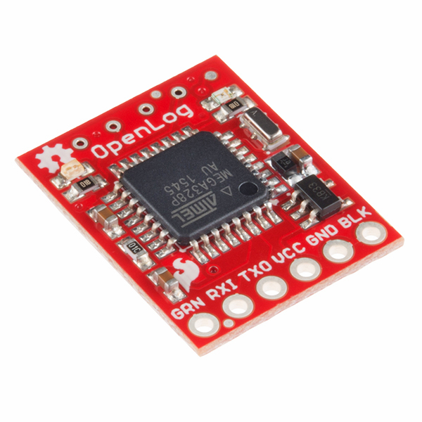
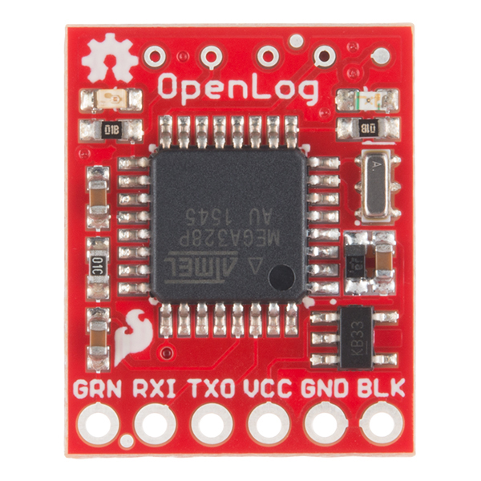
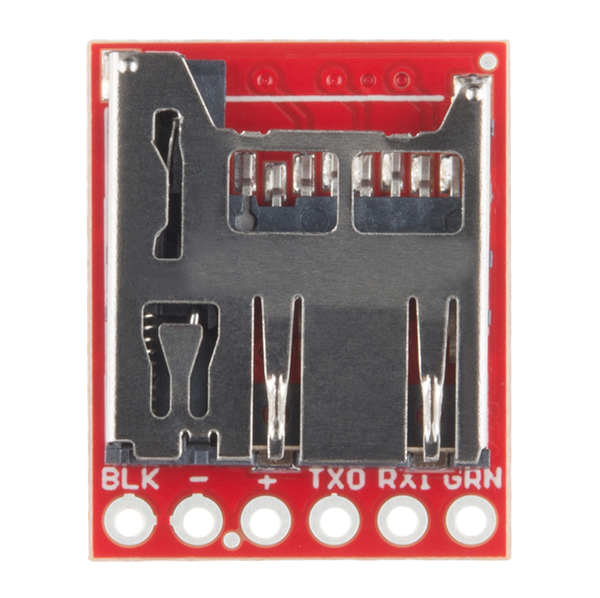
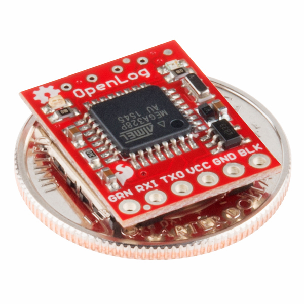

# SparkFun OpenLog

DEV-13712

## Description

The SparkFun OpenLog is an open source data logger that works over a simple serial connection and supports
microSD cards up to 32GB.
The OpenLog can store or "log" huge amounts of serial data and act as a black box of sorts to store all the
serial data that your project generates, for scientific or debugging purposes.

The SparkFun OpenLog uses an ATmega328 running at 16MHz thanks to the onboard resonator.
The OpenLog draws approximately 2-3mA in idle (nothing to record) mode.
During a full record OpenLog can draw 10 to 20mA depending on the microSD card being used.

All data logged by the OpenLog is stored on the microSD card.
Any 512MB to 32GB microSD card should work.
OpenLog supports both FAT16 and FAT32 SD formats.

## Features

- VCC Input: 3.3V-12V (Recommended 3.3V-5V)
- Log to low-cost microSD FAT16/32 cards up to 32GB
- Simple command interface
- Configurable baud rates (up to 115200bps)
- Preprogrammed ATmega328 and bootloader
- Four SPI pogo pins
- Two LEDs indicate writing status
- 2mA idle, 6mA at maximum recording rate

## Documents

- [Schematic](./OpenLog_v15.pdf)
- [Eagle Files](../../ecad/eagle/)
- [Hookup Guide](https://learn.sparkfun.com/tutorials/openlog-hookup-guide)
- [GitHub Hardware Repo](https://github.com/sparkfun/OpenLog)
