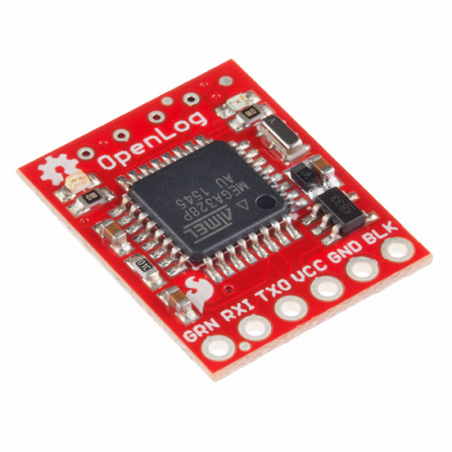
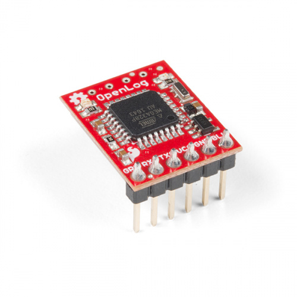
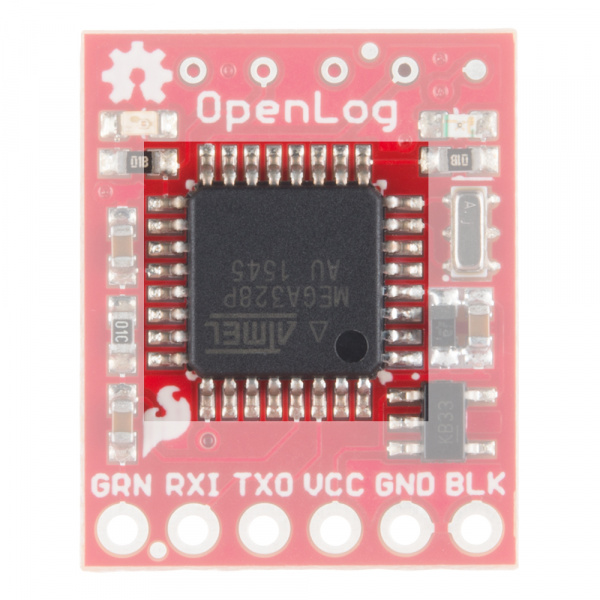
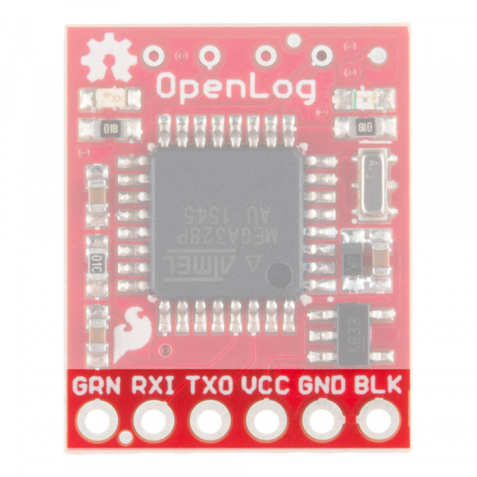
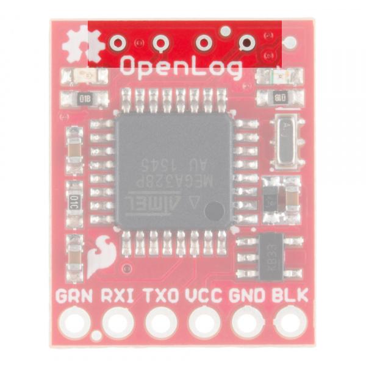
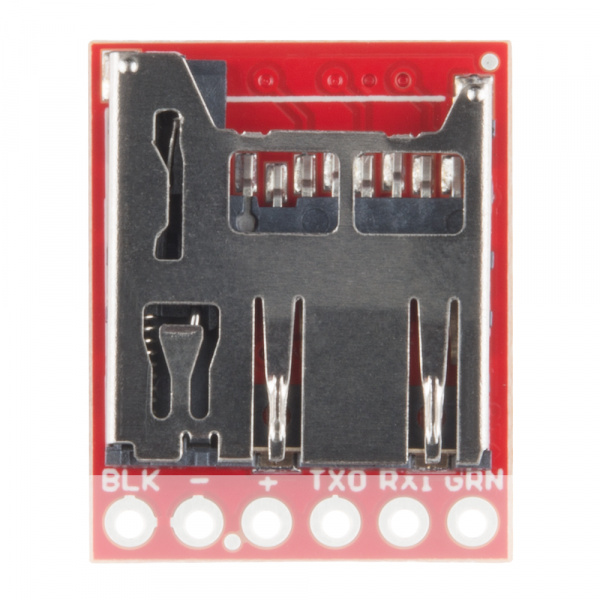
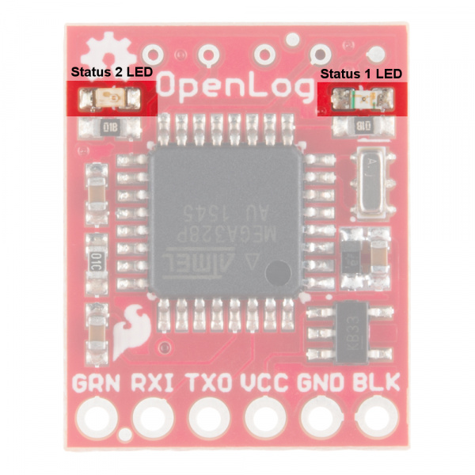
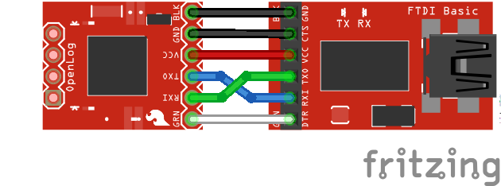
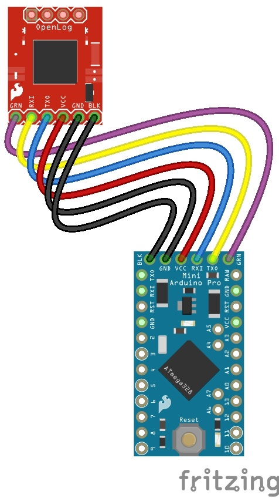

# OpenLog Hookup Guide

## Introduction

Heads up \!

This tutorial is for the Open Log for serial UART [DEV-13712](https://www.sparkfun.com/products/13712).
If you are using the Qwiic OpenLog for I2C [DEV-15164](https://www.sparkfun.com/products/15164),
please refer to the [Qwiic OpenLog Hookup Guide](https://learn.sparkfun.com/tutorials/qwiic-openlog-hookup-guide).

The [OpenLog Data Logger](https://www.sparkfun.com/products/13712)
is a simple-to-use, open-source solution for logging serial data from your projects.
The OpenLog provides a simple serial interface to log data from a project to a microSD card.

<i>DEV-17312</i>.

<i>DEV-13955</i>.

## Materials Required

In order to fully work through this tutorial, you will need the following parts.
You may not need everything though depending on what you have.
Add it to your cart, read through the guide, and adjust the cart as necessary.

OpenLog Hookup Guide SparkFun Wish List:

- [Arduino Pro Mini 328 - 3.3V/8MHz](https://www.sparkfun.com/products/11114)
- [SparkFun FTDI Basic Breakout - 3.3V](https://www.sparkfun.com/products/9873)
- [SparkFun Cerberus USB Cable - 6ft](https://www.sparkfun.com/products/12016)
- [SparkFun OpenLog](https://www.sparkfun.com/products/13712)
- [microSD Card - 16GB (Class 10)](https://www.sparkfun.com/products/15051)
- [microSD USB Reader](https://www.sparkfun.com/products/13004)
- [Female Headers](https://www.sparkfun.com/products/115)
- [Jumper Wires Premium 6" M/M Pack of 10](https://www.sparkfun.com/products/8431)
- [Break Away Male Headers - Right Angle](https://www.sparkfun.com/products/553)

## Recommended Reading

If you are not familiar or comfortable with the following concepts, we recommend reading through these before
 continuing on with the OpenLog Hookup Guide.

- [How to Solder: Through-Hole Soldering](https://learn.sparkfun.com/tutorials/how-to-solder-through-hole-soldering)
- [Serial Communication](https://learn.sparkfun.com/tutorials/serial-communication)
- [Serial Peripheral Interface (SPI)](https://learn.sparkfun.com/tutorials/serial-peripheral-interface-spi)
- [Serial Terminal Basics](https://learn.sparkfun.com/tutorials/terminal-basics)

## Hardware Overview

### Power

The OpenLog runs at the following settings:

|                             | OpenLog Power Ratings                                             |
|-----------------------------|-------------------------------------------------------------------|
| VCC Input                   | 3.3 V - 12 V (Recommended 3.3V-5V)                                |
| RXI Input                   | 2.0 V - 3.8 V                                                     |
| TXO Output                  | 3.3 V                                                             |
| Idle Current Draw           | ~2 mA - 5 mA (w/out microSD card), ~5 mA - 6 mA (w/ microSD card) |
| Active Writing Current Draw | ~20 - 23 mA (w/ microSD card)                                     |

The OpenLog's current draw is about <b>20 mA to 23 mA</b> when writing to a microSD.
Depending on the size of the microSD card and its manufacturer, the active current draw can
vary when the OpenLog is writing to the memory card.
Increasing the baud rate will also pull more current.

### Microcontroller
The OpenLog runs off of an onboard ATmega328, running at 16MHz thanks to the onboard crystal.
The ATmega328 has the Optiboot bootloader loaded on it, which allows the OpenLog to be compatible with
the "Arduino Uno" board setting in the Arduino IDE.

The brain of the OpenLog.

### Interface

#### Serial UART

The primary interface with the OpenLog is the FTDI header on the board edge.
This header is designed to plug directly into an [Arduino Pro](https://www.sparkfun.com/products/10914?_ga=2.55689964.694174263.1590665839-1944887866.1590267962)
or [Pro Mini](https://www.sparkfun.com/products/11114?_ga=2.55689964.694174263.1590665839-1944887866.1590267962),
which allows the microcontroller to send the data over a serial connection to the OpenLog.

Serial Connection Header.

<b>Warning!</b> Because of the pin ordering that makes it compatible with the Arduinos, it <b>cannot</b> plug directly into
an [FTDI breakout board](https://www.sparkfun.com/products/9873).

- [DEV-09873](https://www.sparkfun.com/products/9873)

- [CAB-11301](https://www.sparkfun.com/products/11301)

For more information, make sure to check out the next section on
the [Hardware Hookup](https://learn.sparkfun.com/tutorials/openlog-hookup-guide#hardware-hookup).

#### SPI

There are also four SPI test points broken out on the opposite end of the board.
You can use these to reprogram the bootloader on the ATmega328.

SPI Test Points.

The latest OpenLog (DEV-13712) breaks out these pins on smaller plated through holes.
If you need to use an [ISP](https://learn.sparkfun.com/tutorials/installing-an-arduino-bootloader#connecting-the-programmer)
to reprogram or upload a new bootloader to the OpenLog, you can use [pogo pins](https://www.sparkfun.com/products/9174)
to connect to these test points.

The final interface for communicating with the OpenLog is the microSD card itself.
To communicate, the microSD card requires SPI pins.
Not only is this where the data is stored by the OpenLog, but you can also update the OpenLog's configuration
via the config.txt file on the microSD card.

#### microSD Card

All data logged by the OpenLog is stored on the microSD card.
The OpenLog works with microSD cards that involve the following features:

- 64MB to 32GB
- FAT16 or FAT32

microSD Slot on the bottom of the OpenLog.

#### Status LED

There are two status LEDs on the OpenLog to help you with troubleshooting.

- <b>STAT1</b> - This blue indicator LED is attached to Arduino <b>D5</b> (ATmega328 PD5)
  and toggles on/off when a new character is received.
  This LED blinks when Serial communication is functioning.
- <b>STAT2</b> - This green LED is connected to Arduino <b>D13</b> (SPI Serial Clock Line/ ATmega328 PB5).
  This LED only blinks when the SPI interface is active.
  You will see it flash when the OpenLog records 512 bytes to the microSD card.

Status LEDs on the OpenLog.

## Hardware Hookup

There are two main methods for connecting your OpenLog to a circuit.
You will need some headers or wires to connect.
Make sure that you [solder to the board](https://learn.sparkfun.com/tutorials/how-to-solder-through-hole-soldering)
for a secure connection.

### Basic Serial Connection

<b>Tip:</b> If you have a female header the OpenLog and female header on the FTDI you will need
M/F jumper wires to connect.

- [Female Headers](https://www.sparkfun.com/products/115)
- [Jumper Wires Premium 6" M/M Pack of 10](https://www.sparkfun.com/products/8431)

This hardware connection is designed for interfacing with an OpenLog if you need to reprogram the board,
or log data over a basic serial connection.

Make the following connections:

OpenLog --> 3.3V FTDI Basic Breakout

- GND --> GND
- GND --> GND
- VCC --> 3.3V
- TXO --> RXI
- RXI --> TXO
- DTR --> DTR

Notice that it is <b>not</b> a direct connection between the FTDI and OpenLog - you must switch
the TXO and RXI pin connections.

Your connections should look like the following:

Once you have the connections between the OpenLog and the FTDI Basic, plug your FTDI board into
a USB cable and into your computer.

Open up a serial terminal, connect to the COM port of your FTDI Basic, and go to town \!

### Project Hardware Connection

<b>Tip:</b> If you have the female headers soldered on the OpenLog, you can solder male headers to the
Arduino Pro Mini to plug the boards together without the need for wires.

- [Break Away Headers - Straight](https://www.sparkfun.com/products/116)
- [Break Away Male Headers - Right Angle](https://www.sparkfun.com/products/553)

While interfacing with the OpenLog over a serial connection is important for reprogramming or debugging,
the place where OpenLog shines is in an embedded project.
This general circuit is how we recommend you hook up your OpenLog to a microcontroller (in this case,
an Arduino Pro Mini) that will write serial data out to the OpenLog.

First you will need to upload the code to your Pro Mini you intend to run.
Please check out the [Arduino Sketches](https://learn.sparkfun.com/tutorials/openlog-hookup-guide#arduino-sketches)
for some example code that you can use.

<b>Note:</b> If you are unsure how to program your Pro Mini, please check out our tutorial
[here](https://learn.sparkfun.com/tutorials/using-the-arduino-pro-mini-33v).

- [Using the Arduino Pro Mini 3.3V](https://learn.sparkfun.com/tutorials/using-the-arduino-pro-mini-33v)

Once you have programmed your Pro Mini, you can remove the FTDI board, and replace it with the OpenLog.
<b>Make sure</b> to connect the pins labeled BLK on both the Pro Mini and OpenLog (the pins labeled GRN on both
will also match up if done correctly).

If you cannot plug the OpenLog directly into the Pro Mini (due to mismatched headers or other boards in the
way), you can use jumper wires and make the following connections.

OpenLog --> Arduino Pro/Arduino Pro Mini

- GND --> GND
- GND --> GND
- VCC --> VCC
- TXO --> RXI
- RXI --> TXO
- DTR --> DTR

Once you're finished, your connections should look like the following with the Arduino Pro Mini and Arduino Pro.
The Fritzing diagram shows the OpenLogs with the headers mirrored.
If you flip the microSD socket relative to the Arduino's top view, they should match the programming header like an FTDI.

Note that the connection is a straight shot with the OpenLog "upside-down" (with the microSD facing up)

<b>Note:</b> Since Vcc and GND between the OpenLog and Arduino are being occupied by the headers, you'll need to
connect to power to the other pins available on the Arduino.
Otherwise, you could solder wires to the exposed power pins on either board.

Power up your system, and you are ready to start logging \!

## Arduino Sketches

There are six different examples sketches included that you can use on the Arduino when connected to an OpenLog.

- <b>OpenLog_Benchmarking</b> -- This example is used to test OpenLog. This sends very large amounts of data at 115200bps over multiple files.
- <b>OpenLog_CommandTest</b> -- This example shows how to create and append a file via command line control through the Arduino.
- <b>OpenLog_ReadExample</b> -- This example runs through how to control the OpenLog via command line.
- <b>OpenLog_ReadExample_LargeFile</b> -- Example of how to open a large stored file on OpenLog and report it over a local bluetooth connection.
- <b>OpenLog_Test_Sketch</b> -- Used to test OpenLog with lots of serial data.
- <b>OpenLog_Test_Sketch_Binary</b> -- Used to test OpenLog with binary data and escape characters.

## Firmware

The OpenLog has two primary pieces of software on board: the bootloader and the firmware.

### Arduino Bootloader

<b>Note:</b> If you are using an OpenLog that was purchased prior to March 2012, the onboard bootloader is
compatible with the "<b>Arduino Pro or Pro Mini 5V/16MHz w/ ATmega328</b>" setting in the Arduino IDE.

As mentioned previously, the OpenLog has the Optiboot serial bootloader on board.
You can treat the OpenLog just like an <b>Arduino Uno</b> when uploading example code or new firmware to the board.

If you end up bricking your OpenLog and need to reinstall the bootloader, you will also want to
upload Optiboot onto the board.
Please check out our tutorial on
[installing an Arduino Bootloader](https://learn.sparkfun.com/tutorials/installing-an-arduino-bootloader)
for more information.

### Compiling and Loading Firmware onto the OpenLog

<b>Note:</b> If this is your first time using Arduino, please review our tutorial on
[installing the Arduino IDE](https://learn.sparkfun.com/tutorials/installing-arduino-ide).
If you have not previously installed an Arduino library, please check out our [installation guide to manually
install the libraries](https://learn.sparkfun.com/tutorials/installing-an-arduino-library/all#manually-installing-a-library---windows).
If for any reason you need to update or reinstall the firmware on your OpenLog,
the following process will get your board up and running.

First, please download the [Arduino IDE v1.6.5](https://www.arduino.cc/en/Main/OldSoftwareReleases#previous).
Other versions of the IDE may work to compile the OpenLog firmware, but we have verified this as a known good version.

Next, download the OpenLog firmware and required libraries bundle.

[<b>DOWNLOAD OPENLOG FIRMWARE BUNDLE (ZIP)</b>](https://cdn.sparkfun.com/assets/learn_tutorials/4/9/8/OpenLogBundle.zip).

Once you have the libraries and firmware downloaded, install the libraries into Arduino.
If you are unsure how to manually install the libraries in the IDE, please check out our tutorial:
[Installing an Arduino Library: Manually Installing a Library](https://learn.sparkfun.com/tutorials/installing-an-arduino-library/all#manually-installing-a-library---windows).

<b>Note:</b> We are using modified versions of the SdFat and SerialPort libraries in order to arbitrarily
declare how big the TX and RX buffers should be.
The OpenLog requires the TX buffer to be very small (0) and the RX buffer needs to be as large as possible.
Using these two modified libraries together allows increased performance of the OpenLog.

<b>Looking for the Latest Versions?</b> If you would prefer the most up-to-date versions of the libraries
and firmware, you can download them directly from the GitHub repositories linked below.
The SdFatLib and Serial Port libraries are not visible in the Arduino board manager so you will need to manually
install the library.

- [GitHub: OpenLog > Firmware > OpenLog_Firmware](https://github.com/sparkfun/OpenLog/tree/master/firmware/OpenLog_Firmware)
- Bill Greiman's Arduino Libraries
  - [SdFatLib-beta](https://github.com/greiman/SdFat-beta)
  - [SerialPort](https://github.com/greiman/SerialPort)

Next, to take advantage of the modified libraries, modify the <i>SerialPort.h</i> file found in
<b>\Arduino\Libraries\SerialPort</b> directory.
Change BUFFERED_TX to 0 and ENABLE_RX_ERROR_CHECKING to 0.
Save the file, and open up the Arduino IDE.

If you haven't yet, connect your OpenLog to the computer via an FTDI board.
Please double check the example circuit if you are not sure how to do this properly.

Open the OpenLog sketch you would like to upload under <b>Tools>Board</b> menu, select the
<i>"Arduino/Genuino Uno"</i>, and select the proper COM port for your FTDI board under
<b>Tools>Port</b>.

Upload the code.

That's it \!
Your OpenLog is now programmed with new firmware.
You can now open up a [serial monitor](https://learn.sparkfun.com/tutorials/terminal-basics/arduino-serial-monitor-windows-mac-linux)
and interact with the OpenLog.
On power up, you will see either 12> or 12<.
1 indicates the serial connection is established, 2 indicates the SD card has successfully initialized,
< indicates OpenLog is ready to log any received serial data and > indicates OpenLog is ready to receive commands.

### OpenLog Firmware Sketches

There are three included sketches you can use on the OpenLog, depending on your particular application.

- <b>OpenLog</b> -- This firmware ships by default on the OpenLog. Sending the ?
  command will show the firmware version loaded onto a unit.
- <b>OpenLog_Light</b> -- This version of the sketch removes the menu and command mode,
  allowing the receive buffer to be increased.
  This is a good option for high-speed logging.
- <b>OpenLog_Minimal</b> -- The baud rate must be set in code and uploaded.
  This sketch is recommended for experienced users but is also the best option for the highest speed logging.

## Command Set

You can interface with the OpenLog via a serial terminal.
The following commands will help you read, write, and delete files, as well as change the settings of the OpenLog.
You will need to be in <b>Command Mode</b> in order to use the following settings.

While the OpenLog is in <b>Command Mode</b>, STAT1 will toggle on/off for every character received.
The LED will stay on until the next character is received.

### File Manipulation

- <b>new File</b> - Creates a new file named <i>File</i> in the current directory.
  [Standard 8.3](https://en.wikipedia.org/wiki/8.3_filename) filenames are supported.
  For example, "87654321.123" is acceptable, while "987654321.123" is not.

  - Example: <b>new file1.txt</b>

- <b>append File</b> - Append text to the end of File. Serial data is then read from the UART in a stream
  and adds it to the file.
  It is not echoed over the serial terminal.
  If File does not exist when this function is called, the file will be created.

  - Example: <b>append newfile.csv</b>

- <b>write File OFFSET</b> - Write text to File from the location OFFSET within the file.
  The text is read from the UART, line by line and echoed back.
  To exit this state, send an empty line.

  - Example: <b>write logs.txt 516</b>

- <b>rm File</b> - Deletes File from the current directory.
  [Wildcards](https://www.microsoft.com/resources/documentation/windows/xp/all/proddocs/en-us/find_c_search_wildcard.mspx?mfr=true) are supported.

  - Example: <b>rm README.txt</b>

- <b>size File</b> - Output size of File in bytes.

  - Example: <b>size Log112.csv</b>
  - Output: 11

- <b>read File + START+ LENGTH TYPE</b> - Output the content of <i>File</i> starting from <i>START</i> and going for <i>LENGTH</i>.
  If <i>START</i> is omitted, the entire file is reported.
  If <i>LENGTH</i> is omitted, the entire contents from the starting point is reported.
  If <i>TYPE</i> is omitted, the OpenLog will default to reporting in ASCII.
  There are three output TYPEs:

  - ASCII = 1
  - HEX = 2
  - RAW = 3

  You may leave off some trailing arguments.
  Check the following examples.

